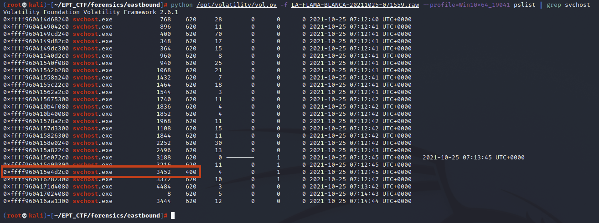
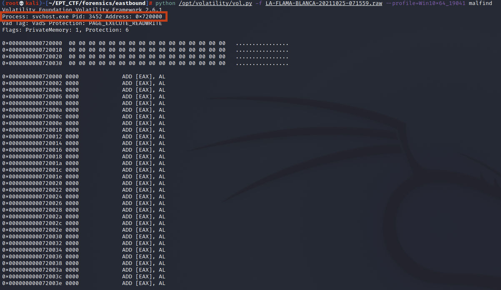
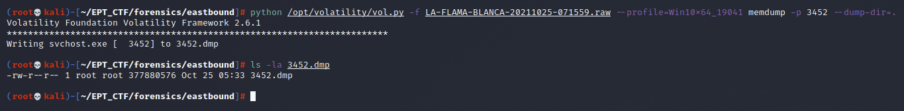
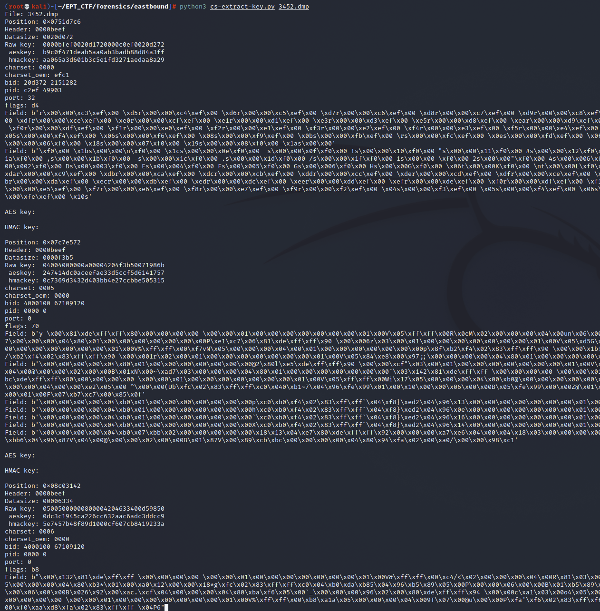
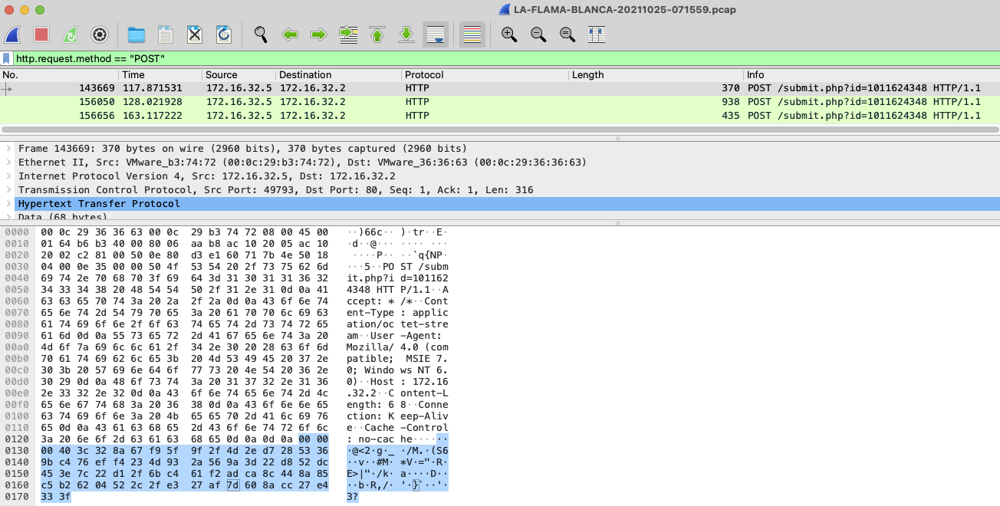
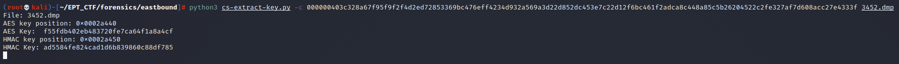
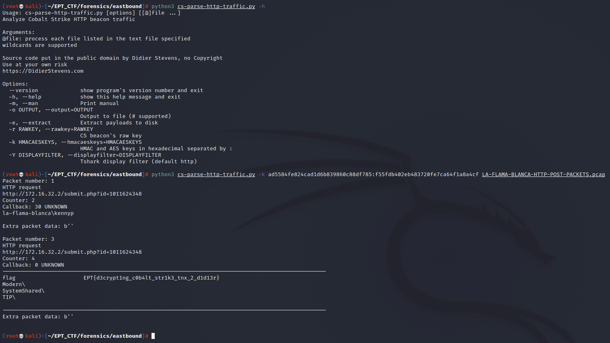

# Eastbound & Pwned solution proposal  

>KennyP thinks that Anti-Virus is for wussies and that his enemies can't
>touch him, but we are now observing hits on a signature that could indicate the
>presence of Cobalt Strike on his computer.
>
>
> We have retrieved the network traffic in question and a memory dump of the machine (`Windows 10 Version 21H1 OS Build 19043.1237`),
> can you figure out what the attacker has been up to?
>

The idea of this challenge is to decrypt the Cobalt Strike C2 beacon traffic from the victim machine back to the attacker. It was inspired by [one of the many great blog posts by Didier Stevens](https://blog.didierstevens.com/2021/04/)
Since we are dealing with a full memdump we first need to locate the malicious process before we can continue with the decryption process. The memdump is from a rather recent Windows build so we have to use [latest volatility version](https://github.com/volatilityfoundation/volatility) with support for Win10 19041 to be able to work with it.

There is a couple of ways to identify the malicious process. One way is by using the ["Hunt Evil"](https://sansorg.egnyte.com/dl/ZkAyckjFTI) approach, to look for anomalies. This should eventually lead you to an svchost.exe process which has the wrong parent id.

`# python /opt/volatility/vol.py -f LA-FLAMA-BLANCA-20211025-071559.raw --profile=Win10x64_19041 pslist | grep svchost `

Malfind is another great plugin for this purpose. Even though it gives a couple of false positives it should be pretty obvious which process we are looking for:

`# python /opt/volatility/vol.py -f LA-FLAMA-BLANCA-20211025-071559.raw --profile=Win10x64_19041 malfind`

Now that we have identified the malicious process we need to dump it so we can start searching for the required keys to decrypt the C2 traffic. If you just dump the process with procdump it will only contain the code for the beacon, so we need to use the memdump plugin to get all the memory data for the process.

`# python /opt/volatility/vol.py -f LA-FLAMA-BLANCA-20211025-071559.raw --profile=Win10x64_19041 memdump -p 3452 --dump-dir=.`

Alright, now we have everything we need to perform the first step of the process - extract the AES and HMAC keys required to decrypt the network traffic. First we try using [cs-extract-key.ps](https://github.com/DidierStevens/Beta/blob/master/cs-extract-key.py) directly on the dumped file:

`# python3 cs-extract-key.py 3452.dmp`

This however shows quite a few false positives and does not seem to work. As we can read in the blogpost: *This method does not always work: the metadata is overwritten after some time, so the process dump needs to be taken quickly after the beacon is started. And there are also cases were this metadata can not be found (I suspect this is version bound).*

Luckily there is another way to achieve this. If we use Wireshark to filter the `http.request.method == "POST"` packets in the provided pcap we can find the data of the first post of the beacon to the C2 and use the encrypted data to obtain the keys:

Now we can extract this hex stream and use it as an input parameter to [cs-extract-key.ps](https://github.com/DidierStevens/Beta/blob/master/cs-extract-key.py) to perform a dictionary attack: extract all possible AES and HMAC keys from the process dump, and try do authenticate and decrypt the callback:

`# python3 cs-extract-key.py -c 000000403c328a67f95f9f2f4d2ed72853369bc476eff4234d932a569a3d22d852dc453e7c22d12f6bc461f2adca8c448a85c5b26204522c2fe327af7d608acc27e4333f 3452.dmp`

BINGO!! We have successfully retrieved the AES and HMAC keys from the dumped process. With the keys at hand we now should be able to decrypt the C2 traffic. But first we need to save the HTTP POST requests to a separate pcap since the decryption will fail on other packets in the provided pcap. Just highlight the packets and export the selected packets only. The blogpost shows an example where the decryption tool is able to obtain the raw key, but since we only have the AES and HMAC keys the command is a bit different:

`# python3 cs-parse-http-traffic.py -k ad5584fe824cad1d6b839860c88df785:f55fdb402eb483720fe7ca64f1a8a4cf LA-FLAMA-BLANCA-HTTP-POST-PACKETS.pcap`

WIN! We have successfully decrypted the Cobalt Strike C2 beacon traffic using [Didier Stevens' POC for decrypting Cobalt Strike Traffic](https://blog.didierstevens.com/2021/04)
If you have implemented your own decryption logic or found an unintended way to solve this challenge, plz let me know as it would be very interesting to know your approach for my own learning.

 >Flagz: **EPT{d3crypt1ng_c0b4lt_str1k3_tnx_2_d1d13r}**

