# sysadmin1 solution proposal

>Our sysadmin has disappeared and we can no longer access our sysadmin web portal.  
>We managed to get an image of his harddrive, but we don't know which bitlocker password corresponds to his drive. Can you help us unlock it?

We are given a bitlocker protected disk image and a file with bitlocker passwords.
Using bitlocker2john we can retrieve the hashes for the bitlocker password used to encrypt the disk.

`bitlocker2john -i sysadmin.vhd`

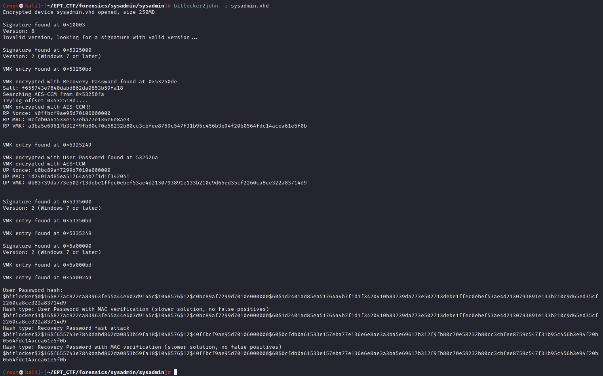

Copy the hashes to an empty textfile and run john with the provided wordlist (bitlocker-passwords.txt)

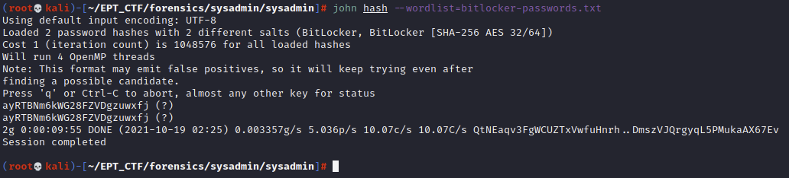

>Sweet, we have retrieved the bitlocker password: ` ayRTBNm6kWG28FZVDgzuwxfj `

## For the next part of the challenges we will use a Windows VM
 
First mount the drive by double clicking the sysadmin.vhd file. This will prompt for a password, so we can input the password we just have retrieved by cracking the hash.  

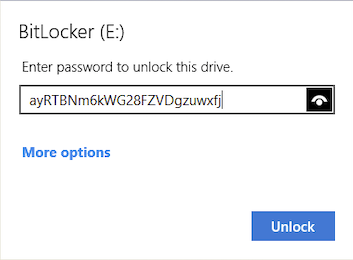

Open the mounted disk and locate the flag.txt in the root folder.

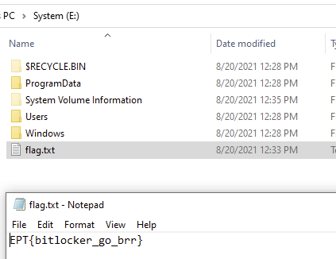

>We have solved the first challenge, and the flag is **EPT{bitlocker_go_brr}**

# sysadmin2 solution proposal

>Our sysadmin has disappeared and we can no longer access our sysadmin web portal.  
>  
>Now that you have unlocked the drive, please see if you can retrieve the SysAdmin Web Portal password.

Now that we have access to the drive our goal is to retrieve a password for a web site. By looking in the %LOCALAPPDATA% we can see that there are no entries for Chrome or Firefox and by opening the History database for MS Edge with sqlitebrowser we can see that the user is using Microsoft Edge as their primary browser. 

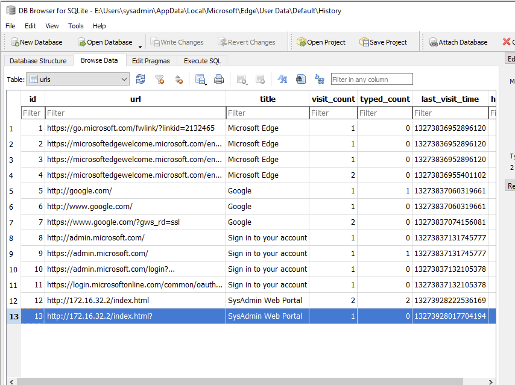

There are entries for visits to the Sysadmin Web Portal so we are on the right track. Let's open the "Login Data" database to see if there are any stored passwords.

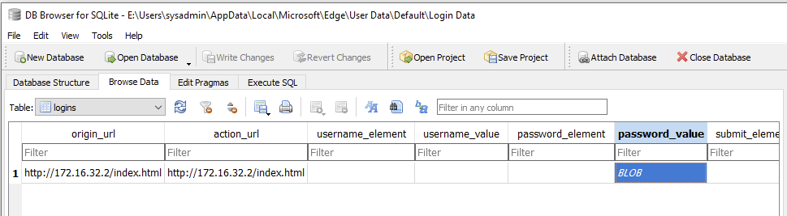

BINGO! This is what we are looking for. However, knowing that Microsoft Edge is using Chromium's OSCrypt to protect stored passwords which again uses DPAPI to preserve the profile's encryption keys, it means that we need to know the users windows login password to be able to decrypt the stored Edge passwords. (For Chromium version 80+ the password is actually encrypted with AES256 and the AES encryption key is encrypted with the DPAPI encryption system. More about that later)

Fortunately we are provided with a disk image that also contains the SAM and SYSTEM registry hives in the Windows\System32\config folder so we can use these to retrieve the NTLM hash for the user and see if his password can be cracked.

There are many ways to get the NTLM hash from the registry hives like samdump2, secretsdump, etc, and of course mimikatz. Since we are already in windows with the drive mounted we will use mimikatz this time.

`mimikatz # lsadump::sam /sam:"E:\Windows\System32\config\SAM" /system:"E:\Windows\System32\config\SYSTEM"`

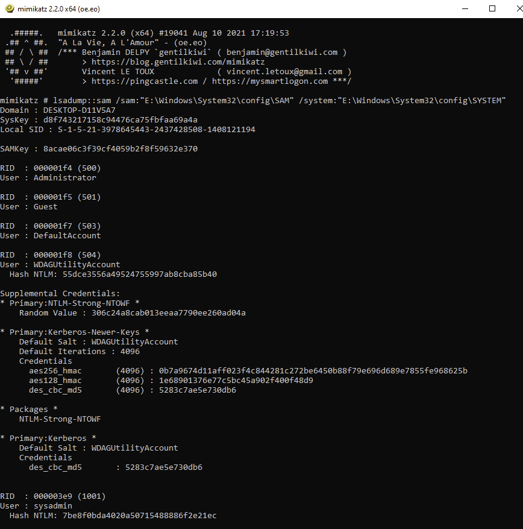

>We have retrieved the NTLM hash for the user: `7be8f0bda4020a50715488886f2e21ec`

Now lets fire up john again, and cross our fingers that the user has a well known password that can be found in our go-to wordlist.

`# echo 7be8f0bda4020a50715488886f2e21ec:7be8f0bda4020a50715488886f2e21ec > ntlm_hash`  
`# john ntlm_hash --wordlist=/usr/share/wordlists/rockyou.txt --format=NT`

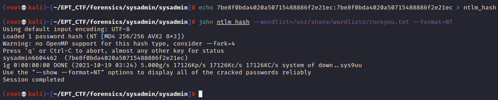

BOOM!

Our sysadmin has the "strong" windows login password *sysadmin6604462*. Now we have everything we need to get our hands on the stored Edge password for the sysadmin web portal.
There are a couple of options on how to proceed here as well. One option is to continue with mimikatz, but there are also tools like NirSoft's ChromePass which is more user friendly.

For the sake of learning and understanding what is going on we will use mimikatz to proceed. Mimikatz can be used to more than dumping ntlm hashes and a very powerful component of Mimikatz is the DPAPI module. If we have access to a users DPAPI masterkeys and also know their cleartext password we can retrieve any secret protected by the Data Protection API.
The DPAPI masterkeys are located in %APPDATA%\Roaming\Microsoft\Protect\\{SID}\\{Key-GUID} and we can see that there are two entries in this folder for our sysadmin user:

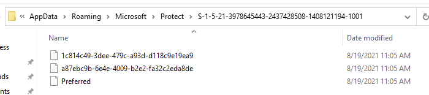

Now using Mimikatz::DPAPI module we will retrieve the decrypted masterkey which again can be used to decrypt secrets.

`mimikatz # dpapi::masterkey /in:"E:\Users\sysadmin\AppData\Roaming\Microsoft\Protect\S-1-5-21-3978645443-2437428508-1408121194-1001\1c814c49-3dee-479c-a93d-d118c9e19ea9" /password:sysadmin6604462`

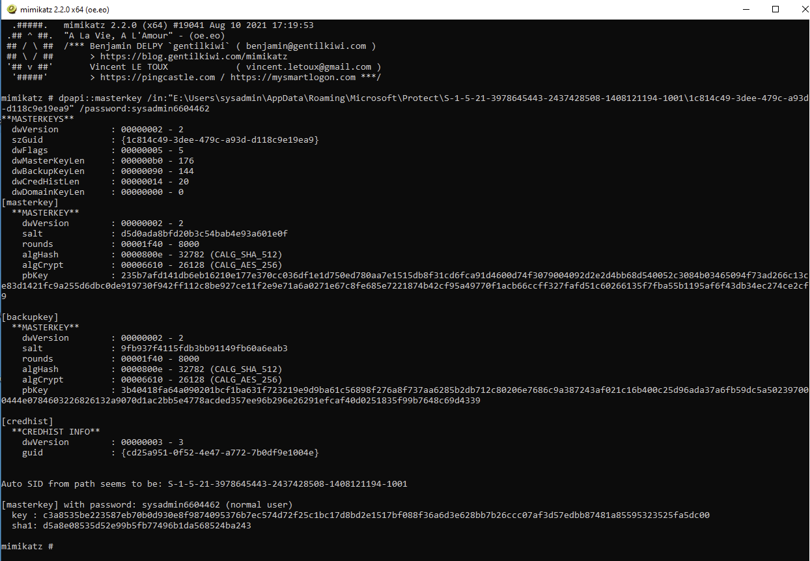

>[masterkey] with password: sysadmin6604462 (normal user)
>
> key : c3a8535be223587eb70b0d930e8f9874095376b7ec574d72f25c1bc17d8bd2e1517bf088f36a6d3e628bb7b26ccc07af3d57edbb87481a85595323525fa5dc00

With this key at hand we can further use the DPAPI Chrome module to decrypt the Microsoft Edge Login Data to get our password.

`mimikatz # dpapi::chrome /in:"E:\Users\sysadmin\AppData\Local\Microsoft\Edge\User Data\Default\Login Data" /masterkey:c3a8535be223587eb70b0d930e8f9874095376b7ec574d72f25c1bc17d8bd2e1517bf088f36a6d3e628bb7b26ccc07af3d57edbb87481a85595323525fa5dc00`

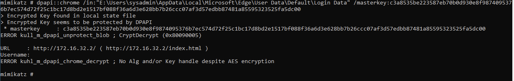

Hmmmmm... that did not work. But, remember we found two entries in the Protect folder so lets try with the other masterkey:

`mimikatz # dpapi::masterkey /in:"E:\Users\sysadmin\AppData\Roaming\Microsoft\Protect\S-1-5-21-3978645443-2437428508-1408121194-1001\a87ebc9b-6e4e-4009-b2e2-fa32c2eda8de" /password:sysadmin6604462`

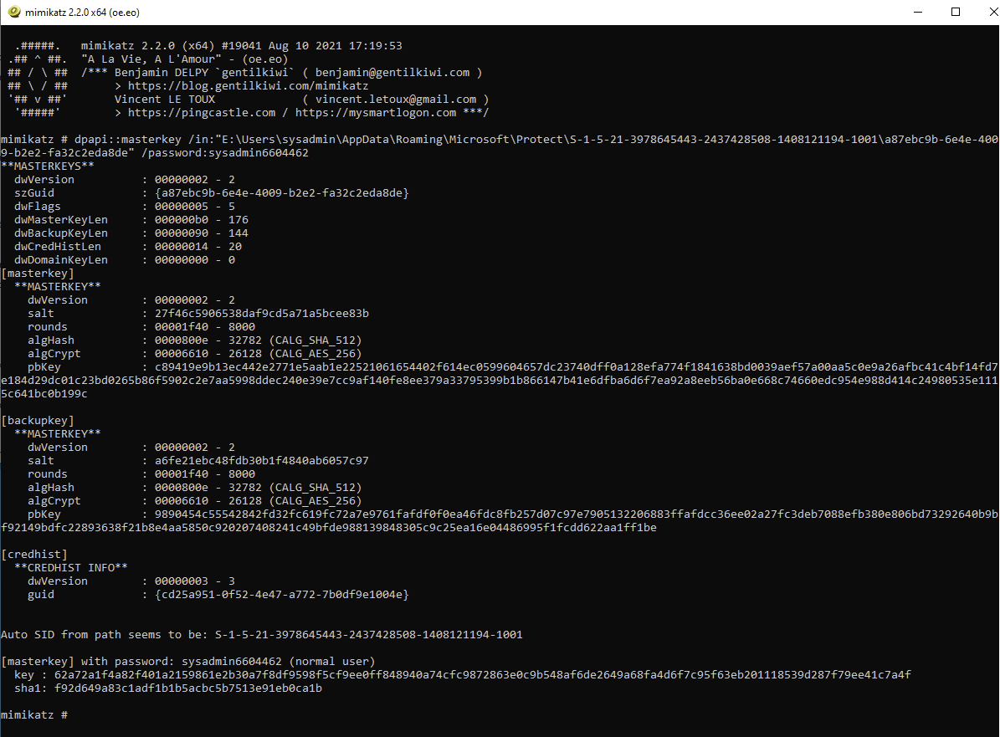

>[masterkey] with password: sysadmin6604462 (normal user)
>
>key : 62a72a1f4a82f401a2159861e2b30a7f8df9598f5cf9ee0ff848940a74cfc9872863e0c9b548af6de2649a68fa4d6f7c95f63eb201118539d287f79ee41c7a4f
 
Ok, now we have the other decrypted masterkey, lets have another go at the Login Data.

 `mimikatz # dpapi::chrome /in:"E:\Users\sysadmin\AppData\Local\Microsoft\Edge\User Data\Default\Login Data" /masterkey:62a72a1f4a82f401a2159861e2b30a7f8df9598f5cf9ee0ff848940a74cfc9872863e0c9b548af6de2649a68fa4d6f7c95f63eb201118539d287f79ee41c7a4f`

 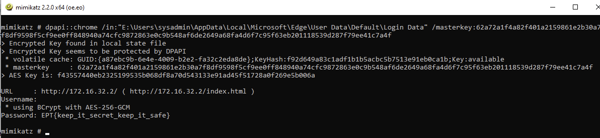

 BOOM! There we go. We have successfully decrypted the DPAPI protected MS Edge stored password by using the DPAPI masterkey and the known user login password.

 >Password: **EPT{keep_it_secret_keep_it_safe}**

 *Please note for browsers based on Chromium versions > 80, in addition to the DPAPI Masterkey and the MS Edge Login Data file we also need the "Local State" file located in the "User Data" folder to successfully decrypt the password. The "Local State" file is the one that contains the AES encryption key used to encrypt the passwords in the Login Data databse, and this key is in turn encrypted with DPAPI. However, Mimikatz will automatically locate this file and do the decryption behind the scenes as long as it is kept in the original file structure. If you just copied out the dpapi masterkeys and the Login data file from the image you will not be able to decrypt the password since we have used a newer version of MS Edge in this challenge.*