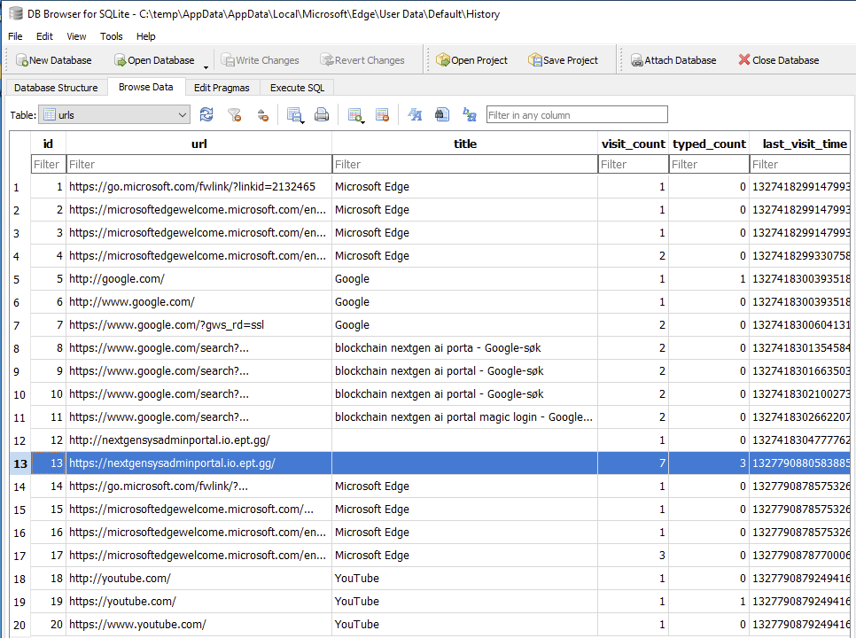
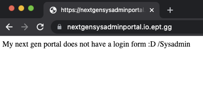
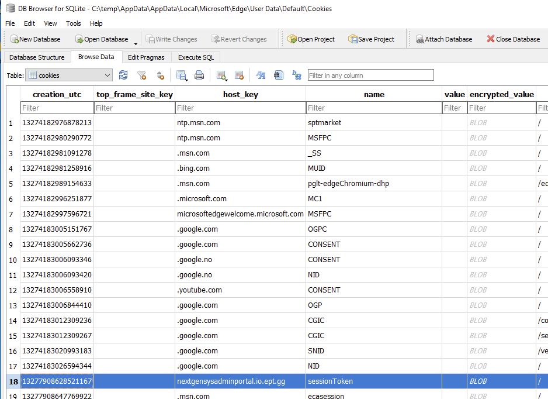
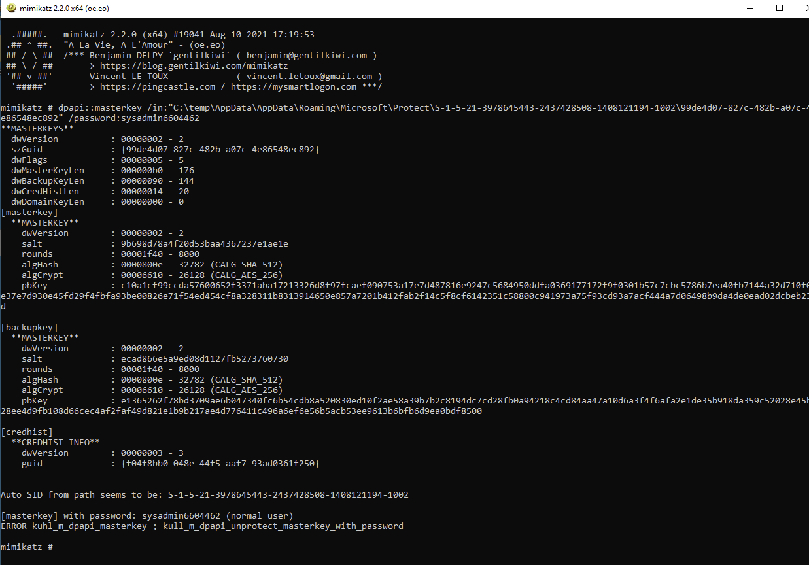
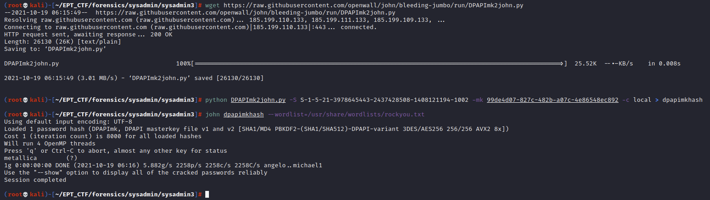
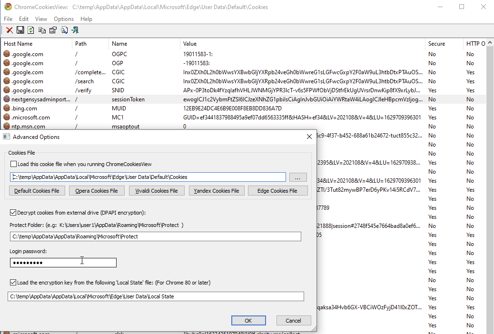
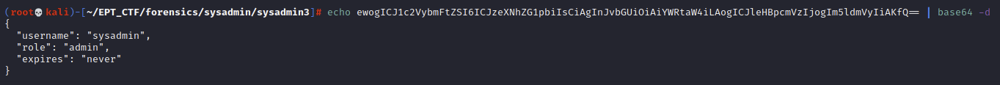
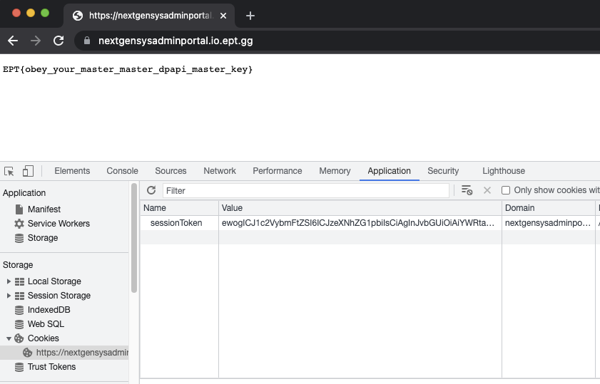

# sysadmin3 solution proposal

>Our sysadmin came back, created a new web portal and ran off mumbling something about job security. 
>
>We need to access his web site, but unfortunately only got a copy of the AppData folder this time. Can you please help us out?
>
>(This challenge can be solved without solving sysadmin1 and sysadmin2)

So the challenge seems to be quite related, even though we are informed that we don't nessecarily need to solve sysadmin1 and syadmin2 prior to this one.

Again, we will start digging into the browser artifacts and we can see that there are a few visits to a site called: https://nextgensysadminportal.io.ept.gg/:

If we try browsing to this site we can see that it is live, but there is no login form.

That means we probably won't find any stored passwords in the Login Data database, but what about cookies?

Alright, seems like we need to get our hands on this sessionToken to access the site, but as with the passwords in Login Data, the cookies are also encrypted with AES256 and the AES encryption key is encrypted with the Data Protection API. So - again we need to get the users windows login password to proceed. Let us try using his password from the previous challenge, in case he did not change the password:

No dice. Seems like he actually changed password in addition to create a new web portal. Now what? Since we are only provided with the AppData folder we don't have the registry hives to dump his NTLM hash. How can we possibly retrieve the cleartext password for the user in this case?

Well, since the DPAPI master keys are in fact encrypted using the users password it is possible to go the opposite way by brute forcing the password using the masterkey. In other words, we can take the hash of the masterkey and run a brute force or dictionary attack on it to possibly retrieve a weak windows login password. Wooot? 

[SUDONULL has a great blog post on this subject with a lot more use cases than what is covered in these challenges](https://sudonull.com/post/6370-Secrets-DPAPI-or-DPAPI-for-pentesters)

Cool, so we don't need an lsass dump, mimikatz or even system privileges to recover the user password, all we need is the DPAPI masterkey, DPAPImk2john.py and a good wordlist (or a lot of time and a powerful crackstation):

Wooop! The new sysadmin user password is `metallica`  
Now that we have the cleartext password we can proceed with using mimikatz just like we did to retrieve the stored MS Edge password in sysadmin2, but for the sake of demonstration we will use one of the many great Nirsoft tools to decrypt the cookies, namely [ChromeCookiesView](https://www.nirsoft.net/utils/chrome_cookies_view.html):

This is a lot more user friendly than mimikatz, and since we now know how this works under the hood we can just provide the locations of the cookies database, the DPAPI masterkey, the local state file and the cleartext password to retrieve the decrypted cookie values.

>Host Name	Path	Name	Value	Secure	HTTP Only	Last Accessed	Created On	Expires  	
>
>nextgensysadminportal.io.ept.gg	/	sessionToken	ewogICJ1c2VybmFtZSI6ICJzeXNhZG1pbiIsCiAgInJvbGUiOiAiYWRtaW4iLAogICJleHBpcmVzIjogIm5ldmVyIiAKfQ==	No	No	10/5/2021 1:59:08 PM	10/5/2021 1:57:08 PM	1/1/9999 >1:00:00 AM`

The sessionToken cookie value seems to be a base64 string which decodes to a simplified unencrypted JWT:

Let's see if we can hijack his session by using this cookie. We'll go back to the https://nextgensysadminportal.io.ept.gg/ and hit F12 to get our developer tools, open the Application pane and add a new cookie named "sessionToken" and insert the JSON Web Token as the cookie value then refresh the page.

WIN! We have successfully decrypted the Microsoft Edge cookies and hijacked the session to the nextgensysadminportal by re-using the valid session cookie.

 >Flagz: **EPT{obey_your_master_master_dpapi_master_key}**